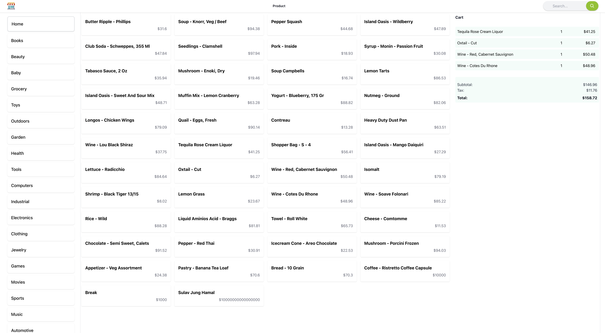

---



Are you a passionate developer looking for an opportunity to expand your skills and enhance your portfolio? Look no further! We are thrilled to invite you to join our Register Management System project, where you will have the chance to work with cutting-edge technologies in both frontend and backend development.

1. **Diverse Technological Exposure**: By joining our project, you will gain invaluable personal experience working with a wide range of technologies. As a full-stack project, you will have the opportunity to delve into both frontend and backend development, giving you a holistic understanding of how these technologies work together in harmony. You will work with Node.js and Express on the server-side, creating robust APIs and handling data management. On the frontend, you will dive into React, utilizing its powerful components and state management to build an intuitive and seamless user interface.

2. **Enhance Your Portfolio**: As developers, having an impressive portfolio is crucial for career growth and attracting potential employers or clients. By contributing to our Register Management System project, you will have a significant addition to your portfolio. Employers and recruiters value real-world projects that showcase your ability to work with different technologies and solve complex problems. This project will serve as a testament to your skills, demonstrating your proficiency in full-stack development and your ability to deliver high-quality software solutions.

3. **Collaborative Environment**: Working on our project means joining a vibrant and collaborative community of developers. As the project creator, I am also new to this and trying to figure things out. I value open communication and the exchange of ideas. Your input and insights are highly encouraged, and we will work together to make this project successful. Together, we can tackle challenges, learn from each other, and create something remarkable.

4. **Practical Problem-Solving**: The Register Management System project provides a practical context for you to apply your development skills to real-world scenarios. You will tackle common problems faced in organizations when it comes to managing registers efficiently. You will have the opportunity to design and implement intuitive user interfaces, handle data validation and storage, and create powerful search and reporting functionalities. By working on this project, you will hone your problem-solving abilities and gain a deeper understanding of how technology can be leveraged to address real-world challenges.

5. **End-to-End Development**: This project offers you the chance to experience the entire software development lifecycle, from requirements gathering and design to implementation and deployment. You will have the opportunity to contribute to all stages of the project, allowing you to broaden your skill set and become a well-rounded developer. This experience will prove invaluable as you progress in your career, giving you the confidence and expertise to take on complex projects independently.

Here is short description of what this project is all about. 


# Register Management System

The Register Management System is a web-based application designed to streamline and digitize the register management processes within an organization. It provides a centralized platform for efficient data entry, search, and retrieval of various types of registers, including attendance logs, visitor records, inventory tracking, and more.

## Key Features

- User-friendly interface for easy navigation and usage.
- Register creation and management functionalities.
- Efficient data entry with validation and error handling.
- Advanced search and filtering options for quick data retrieval.
- Reporting and analytics capabilities for data analysis.
- Role-based access control to ensure data privacy and security.
- Integration with external systems for seamless data exchange.
- Scalable architecture to accommodate future expansion and enhancements.

## Register Management System Tech Stack
The Register Management System is built using a combination of backend and frontend technologies to provide a comprehensive and efficient solution for managing registers within an organization. The tech stack includes:
### Backend
- **Node.js**: A JavaScript runtime that allows running JavaScript code outside the browser. It provides the server-side environment for building web applications.
- **Express**: A fast and minimalist web application framework for Node.js. It simplifies the development of robust and scalable APIs.
- **SQLite**: A lightweight and self-contained database engine. It is used for storing and retrieving register data.

### Frontend
- **React**: A popular JavaScript library for building user interfaces. React allows creating dynamic and interactive frontend components.
- **Tailwind CSS**: A utility-first CSS framework that provides a set of pre-built styles and utility classes. It enables rapid UI development and customization.

### Additional Tools and Libraries
- **npm**: A package manager for Node.js that manages project dependencies and facilitates the installation of required libraries and modules.
- **Webpack**: A module bundler that combines multiple JavaScript modules into a single bundle for efficient loading and execution in the browser.
- **Babel**: A JavaScript compiler that transforms modern JavaScript code into a compatible version for older browsers.
- **Axios**: A popular HTTP client library for making asynchronous requests from the frontend to the backend API.
- **React Router**: A routing library for React that enables client-side navigation and URL routing within the application.

The combination of these technologies provides a powerful and efficient solution for managing registers, offering a seamless user experience and streamlined workflow.

## Getting Started

### Prerequisites

- Node.js (version v18.16.0)
- npm (version 9.5.1)
- Database system (SQLite)

### Installation
1. Clone the repository:
```bash
git clone https://github.com/your-username/register-management-system.git
```

2. Install the dependencies:
```bash
cd registerManagementSystem
npm install
```

3. Start the application:

```bash
npm run develop
```

4. Access the application:
   - Open your web browser and visit `http://localhost:3006` to access the Register Management System.

## Contributing
We welcome contributions to enhance the Register Management System. To contribute, please follow these steps:
1. Fork the repository.
2. Create a new branch for your feature or bug fix.
3. Make your changes and commit them with descriptive commit messages.
4. Push your changes to your forked repository.
5. Submit a pull request, explaining the changes and their purpose.

We appreciate your contributions and will review them as soon as possible. Together, we can make the Register Management System even better!

## License

This project is licensed under the [MIT License](https://opensource.org/licenses/MIT).

## Acknowledgements
We would include the name of the people who make significant contribution to this project. 
- [Name](https://github.com/username) - Provided guidance and support throughout the development process.
- [Project Name](https://github.com/project-name) - Inspired certain aspects or functionality of the Register Management System.

## Contact
Don't miss out on this exciting opportunity to work on a project that combines frontend and backend technologies, enhances your portfolio, and provides you with valuable personal experience. Join our Register Management System project today and embark on a rewarding journey of growth, learning, and professional development!

To get started, simply [follow the project setup instructions](https://github.com/Sulavjung/registermanagementsystem) and join our collaborative community of developers. If you have better understanding how things should be catered, please let me know, and we will work together to make this a successful project. I value your expertise and look forward to collaborating with you to create something amazing!

For any inquiries or further information, please reach out to our team at [contact@sulavhamal.com]. Let's build something incredible together!