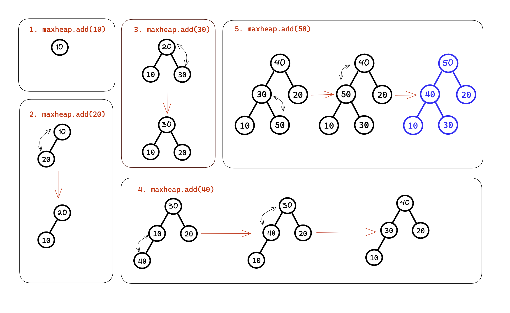
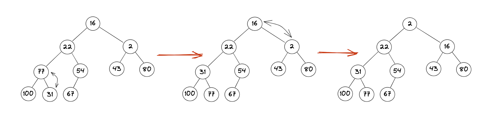
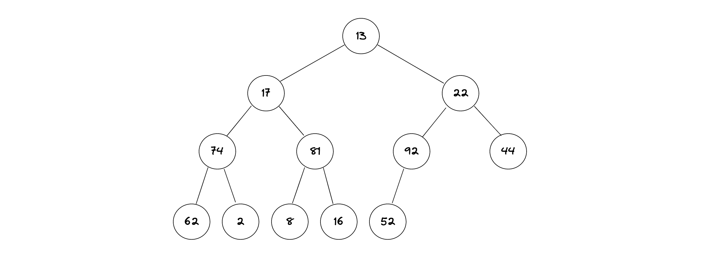

# Question on ADT Tree
---
#### 1. Consider two binary trees, one that has 3 levels and the other that has 10 levels.. Answer the following questions:
#### a. What is the maximum number of nodes in this tree? 
Ans: Maximum number of nodes in a 3-level tree and 10-level tree are: 
- 3 levels = $2^3 -1 =7$ maximum nodes. 
- 10 levels = $2^{10} -1 = 1032$ maximum nodes. 
#### b. What is the maximum number of leaves in this tree? 
Ans: Maximum number of leaves in 3 level tree and 10-level tree are: 
- 3 levels = $2^{3-1} = 4$ is the maximum number of leaves. 
- 10 levels = $2^{10-1} = 512$ is the maximum number of leaves. 

---
#### 2. Write a recursive algorithm, that counts the nodes in a binary tree. Only Pseudo Code is required, along the lines of the format on slide 20 of the class presentation 
Ans: 
```java
Algorithm countNodes(root)
    if root is null then
        return 0
    else
	    //1 for the current node. 
        return 1 + countNodes(left subtree of root) + countNodes(right subtree of root)
```
---
#### 3. Suppose we know the preorder traversal of a binary search tree is as follows: 
#### 6 2 1 4 3 7 10 9 11
#### Show postorder traversal for the same tree 
Ans: 
To find the postorder traversal of the given binary search tree, we first need to construct the tree from its preorder traversal. 

The preorder traversal indicates that the root of the tree is 6, the left subtree consists of values smaller than 6, and the right subtree consists of values larger than 6. 

The first value in the traversal after 6 is 2, which must be the left child of 6. The next value, 1, must be the left child of 2. The value 4 must be the right child of 2, and 3 must be the left child of 4.

Next, we encounter the value 7, which must be the right child of 6. The value 10 must be the right child of 7, and 9 must be the left child of 10. Finally, the value 11 must be the right child of 10.

So, the constructed binary search tree is:

```java
         6
       /   \
      2     7
     / \     \
    1   4    10
       /     / \
      3     9   11
```

To find the postorder traversal, we visit the left subtree, then the right subtree, and finally the root. So the postorder traversal for the above tree is:

```java
1 3 4 2 9 11 10 7 6
```
---
#### 4. Write an interface GeneralTreeInterface for a general tree, along the lines of Slide 13, with interface for a binary tree. 
Ans: 
```java
//Interface for a binary tree. 
public interface generalTreeInterface<T> extends treeInterface<T>, treeIteratorInterface<T> {

public void setRootData(T rootData);

public boolean addChild(T subtreeRootData);

public boolean removeChild(T subtreeRootData);

public Iterator<T> getChild(T nodeData);

public boolean isLeaf(T nodeData);

}
```

---
#### 5. Trace the addition of each of the following values to an initially empty maxheap: 
#### 10 20 30 40 50
#### Be sure to draw the progressive buildout of the heap after insertion of each of the above element
Ans: 



---
#### 6. Trace the formation of a maxheap by the constructor given in Segment 27.16 for each of the following arrays:
#### (a) 10  20  30  40  50
Ans: 
When we pass this as array in the Max heap constructor. It then creates the heap with the for loop like this: 

| null | 10  | 20  | 30  | 40  | 50  |
| ---- | --- | --- | --- | --- | --- |

Then the constructor call the reheap function for the parent indexes only. Thus, creating the resulting Max Heap like this: 

| null | 50  | 40  | 30  | 10  | 20  |
| ---- | --- | --- | --- | --- | --- |


#### (b) 10  20  30  40  50  60  70  80  90  100[5pts]
Ans: When we pass this as array in the max heap constructor. It then creates the heap with the for loop like this: 
| null | 10  | 20  | 30  | 40  | 50  | 60  | 70  | 80  | 90  | 100 |
| ---- | --- | --- | --- | --- | --- | --- | --- | --- | --- | --- |

Then the constructor call the reheap function for the parent indexes only. Thus, creating the resulting Max Heap like this: 
| null | 100 | 90  | 70  | 80  | 50  | 60  | 30  | 10  | 40  | 20  |
| ---- | --- | --- | --- | --- | --- | --- | --- | --- | --- | --- |

---
#### 7. Consider the following integers. 
| 6   | 12  | 2   | 77  | 54  | 43  | 80  | 100 | 31  | 67  |
| --- | --- | --- | --- | --- | --- | --- | --- | --- | --- |

#### (a) Draw a min heap from the above-mentioned numbers [15 pts]

Ans: 


#### (b) Put it in an array and write a method to add an element to the minheap and continue to maintain it as a minheap after addition [15 pts]
```java
import java.util.Arrays;

/**
 * This is Min Heap class. 
 */
public class MinHeap {

	//private helper variables. 
    private int[] heap;
    private int size;

	//Min Heap of size 10. 
    public MinHeap() {
        heap = new int[10];
        size = 0;
    }

	/**
	 * This add method takes the value to store it in the heap and set it properly. 
	 * @param value is the value to be added in the heap. 
	 */
    public void add(int value) {
		//When the heap is full. 
        if (size == heap.length) {
            heap = Arrays.copyOf(heap, heap.length * 2);
        }
		//Add the element to the last of the array. 
        heap[size++] = value;

		//Re-minheapify the heap. 
        bubbleUp(size - 1);
    }

	/**
	 * This will help to heapify the heap in min heap pattern. 
	 * @param index is the index of the node being added. 
	 */
    private void bubbleUp(int index) {
		//Getting the parent index. 
        int parentIndex = (index - 1) / 2;

		//This is doing the recursion. Index>0 is the stop point here for the recursion and index is decreasing as well. 
        if (index > 0 && heap[index] < heap[parentIndex]) {
            swap(index, parentIndex);
            bubbleUp(parentIndex);
        }
    }

	/**
	 * This method is to swap two nodes. 
	 * @param index1 is the index of the node. 
	 * @param index2 is the index of the parent node usually. It doesn't matter which one is the parent index though.
	 */
    private void swap(int index1, int index2) {
		//Saving the value of the index1 to the temp to save the data.
        int temp = heap[index1];
        heap[index1] = heap[index2];
        heap[index2] = temp;
    }

    @Override
    public String toString() {
        return Arrays.toString(Arrays.copyOf(heap, size));
    }


	//Main method to test the Class. 
    public static void main(String[] args) {

		//Creating a instance of MinHeap object defined in the class above and adding the data given to us. 
        MinHeap heap = new MinHeap();
        heap.add(16);
        heap.add(22);
        heap.add(2);
        heap.add(77);
        heap.add(54);
        heap.add(43);
        heap.add(80);
        heap.add(100);
        heap.add(31);
        heap.add(67);

		//Printing out the min heap. 
        System.out.println(heap);
    }
}
```

---
#### 8. Consider the following array of integers that represents a heap:
| 13  | 17  | 22  | 74  | 81  | 92  | 44  | 62  | 2   | 8   | 16  | 52  |
| --- | --- | --- | --- | --- | --- | --- | --- | --- | --- | --- | --- |

#### a) Draw a heap from the above-mentioned numbers, and specify which type of heap is it (min/max) and explain in 1 sentence why so [10 pts]  
Hint: Make first number the root(level 1), and then start adding the next set of numbers as nodes at each level(s), as discussed in class.




Ans: The given array can be classified neither as a min heap nor as a max heap as it does not satisfy neither property. In a min heap, the parent nodes are always smaller than their child nodes. But, if we look at the above tree, we can see 74 is parent node and yet have 2 at child node. Thus, that makes it not minheap. 
In max heap, the parent nodes are always greater than their child nodes. However, in the given array, 17 is parent node and yet have 74 at child node. Thus, that makes it not maxheap. 
#### (b)  Write a method, isMinHeap(), that takes an array of integers as an argument and checks to if array represents a minheap, and returns true if the heap is minheap and false if otherwise [20 pts]
#### (c) Test your method, once using an array that represents a minheap and once with an array that does not represent a minheap
Ans: 

```java
/**
 * Name: Sulav Jung Hamal
 * Class: 2023 Spring Sem CS220. 
 * Related To: Group Assignment 9
 * 
 * This is the min Heap class with the main function to test the isMinHeap() method that is described here. 
 * 
 */

public class MinHeapTest {

	/**
	 * This method check the given array is minheap or not. 
	 * @param arr is the array of values. 
	 * @return false if not minheap. True if minheap. 
	 */
	public static boolean isMinHeap(int[] arr) {
		// Length of the arry for the loop.
		int n = arr.length;

		// Looping through each index element upto the parent indexes.
		for (int i = 0; i <= (n / 2) - 1; i++) {

			// Calculating the left and right child of the parent indexes.
			int left = 2 * i + 1;
			int right = 2 * i + 2;

			// Checking if the left child is small than the parent. If so, it should return
			// false for minheap.
			if (left < n && arr[left] < arr[i]) {
				return false;
			}

			// Checking if the right child is small than the parent. If so, it should return
			// false for minheap.
			if (right < n && arr[right] < arr[i]) {
				return false;
			}
		}

		// if Everything ran through, than means the heap is minheap. Thus returning
		// true.
		return true;
	}

	// Main method to check the method that is created above.
	public static void main(String[] args) {
		int[] heap1 = { 13, 17, 22, 74, 81, 92, 44, 62, 2, 8, 16, 52 };
		int[] heap2 = { 2, 22, 16, 31, 54, 43, 80, 100, 77, 67};

		System.out.println(" ");
		System.out.println("Heap1 isMinHeap: ->" + isMinHeap(heap1));
		System.out.println("Heap2 isMinHeap: ->" + isMinHeap(heap2));
		System.out.println(" ");
	}

}
```
---
#### 9. Consider a traversal of a binary tree and suppose that visiting a node means to simply display the data in the node. What are the results of each of the following traversals of the tree in Figure below
#### (a) Pre-order
$$
\large 14 \to 62 \to 7 \to 6 \to 14 \to 2 \to 8 \to 41 \to 52 \to 91 \to 5
$$
#### (b) Post-order
$$
\large 6 \to 14 \to 7 \to 2 \to 62 \to 52 \to 41 \to 5 \to 91 \to 8 \to 14
$$
#### (c) In-order 
$$
\large 6 \to 7 \to 14 \to 62 \to 2 \to 14 \to 41 \to 8 \to 52 \to 91 \to 5
$$
#### (d) Level-order
$$
\large 14 \to 62 \to 8 \to 7 \to 2 \to 41 \to 91 \to 6 \to 14 \to 52 \to 5
$$

OR: 

#### a) Pre-order
| 14  | 62  | 7   | 6   | 14  | 2   | 8   | 41  | 52  | 91  | 5   |
| --- | --- | --- | --- | --- | --- | --- | --- | --- | --- | --- |

#### b) Post-order
| 6 | 14 | 7 | 2 | 62 | 52 | 41 | 5 | 91 | 8 | 14 |
| - | -- | - | - | -- | -- | -- | - | -- | - | -- |

#### c) In-order
| 6 | 7 | 14 | 62 | 2 | 14 | 41 | 8 | 52 | 91 | 5 |
| - | - | -- | -- | - | -- | -- | - | -- | -- | - |

#### d) Level-order
 | 14 | 62 | 8 | 7 | 2 | 41 | 91 | 6 | 14 | 52 | 5 |
 | -- | -- | - | - | - | -- | -- | - | -- | -- | - |
