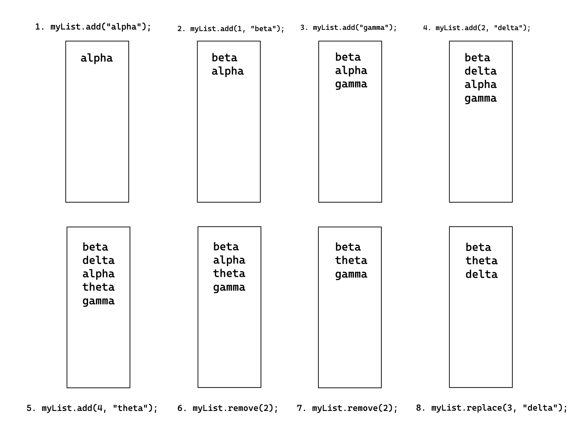
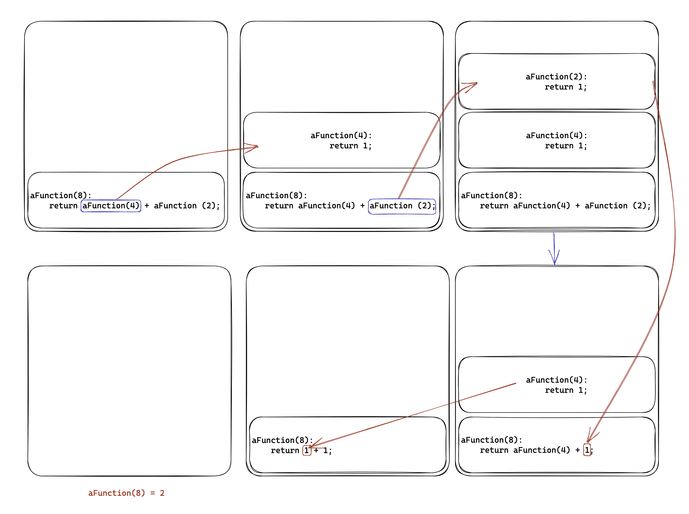

# Few Questions on ADT List and Recursion
---

#### 1. With the code to create and update the myL list object in the code below, show the state of the list object after each statement is executed [10 pts]
```js
ListInterface<String> myList = new MyList();

myList.add("alpha");
myList.add(1, "beta");
myList.add("gamma");
myList.add(2, "delta");
myList.add(4, "theta");
myList.remove(2);
myList.remove(2);
myList.replace(3, "delta");
```
Ans: 



---
#### 2.  Suppose that the ADT list did not have a method replace. Write a method called myReplaceMethod that will replace an object in a list. [10 pts]
#### Assume the following:  
 - #### Name of the list is nameList  
 - #### Position of the object that needs to be replaced in the above list is called location - The replacement object is called newObj
Ans: 
```js
/**
 * Replaces an object at a given position in a list with a new object.
 * 
 * @param nameList  the list containing the object to be replaced
 * @param location  the position of the object to be replaced
 * @param newObj    the new object to replace the existing object
 * 
 * @throws IndexOutOfBoundsException if the given location is invalid
 */
public static void myReplaceMethod(ListInterface<String> nameList, int location, String newObj) {
    // Check if location is within valid range
    if (location < 1 || location > nameList.getLength()) {
        throw new IndexOutOfBoundsException("Invalid index");
    }
    
    // Remove existing element at location
    nameList.remove(location);
    
    // Add new element at same location
    nameList.add(location, newObj);
}
```

---
#### 3. Suppose you have a list created by the following statement:
`ListInterface<Double> quizScores = new MyList<>();`
#### Imagine someone has added to this list the quiz scores received by a student throughout a course. The class teacher would like to know the average of these quiz scores, ignoring the lowest score
#### Write a method computeAvgWithoutLowest that will use this list to find and remove the lowest score in the list, then compute the average based on the remaining scores in the list [20 pts]
Note:  
You may put all the code in one method, or first remove lowest from the list and then call another method that takes a list and computes average of the list.

Ans: FYI I've also included the class in the attached files. 
```js
/**
 * This will calculate the Average removing the lowest score from the list. 
 * @param quizScores is the list of the score. 
 * @return average score value. 
 */
public static double computeAvgWithoutLowest(List<Double> quizScores){
	//Remove the Lowest Score. 
	double lowestScore = Double.MAX_VALUE;
	int lowestIndex = -1;
	double totalScore = 0;
	for (int i = 0; i < quizScores.size(); i++) {
		double score = quizScores.get(i);
		if(score < lowestScore)
		{
			lowestScore = score;
			lowestIndex = i;
		}
	}
	//Remove the lowest index. 
	if(lowestIndex > -1){
		quizScores.remove(lowestIndex);
	}
	//Calculate the average of the quizScores now. 
	for(double score: quizScores){
		totalScore = totalScore + score;
	}
	return totalScore/quizScores.size();
}
```

---
#### 4.  Consider the method getPosition that is outlined in the Exercise 4 of Chapter 10. Write an implementation of this method for the class AList, as referenced in the implementation of class RoadRace in Listing 10-2 and also Listing 11-1. [15 pts]
```js
/**
 * Finds the position of the specified object in this list.
 *
 * @param anObject the object to find the position of
 * @return the position of the object in the list, or -1 if not found
 */
public int getPosition(T anObject){
	checkIntegrtiy();
	for(int i = 1; i <= numberOfEntries; i++){
		if(list[i].equals(anObject)){
			return i;
		}
	}
	return -1; //if not found. 
}
```
---
#### 5.  The method replace for the ADT list returns the replaced object
#### (a) Implement a method replace for the class AList that returns a boolean instead [5 pts]
Ans: 
```js
//Replace method that will return boolean.
public boolean replace(int givenPosition, T newEntry) {
    checkIntegrity();
    if (givenPosition < 1 || givenPosition > numberOfEntries) {
        return false; // invalid position
    } else {
        list[givenPosition] = newEntry;
        return true; // replacement successful
    }
}
```
#### (b) Can you do this without revising ListInterface? Briefly describe how would you do that? [5 pts]
Ans: No, you cannot modify the return type of the `replace` method without revising `ListInterface`. The interface specifies that the `replace` method should return the replaced element, and any implementation of the interface must conform to that specification. Changing the return type would break the contract of the interface.


---
#### 6.  Suppose you want an operation for the ADT list that adds an array of items to the end of the list. The header of the method could be as follows:
`   public void addAll(T[] items)`
#### Write an implementation of this method for the class LList as defined in the Listing 12-1 [15 pts]
Ans: 
```js
/**
 * Adds an array of items to the end of the list.
 * @param items the array of items to be added
 */
public void addAll(T[] items) {
    // Iterate over each item in the array
    for (T item : items) {
        // Add the item to the end of the list
        add(item);
    }
}
```
---
#### 7. Suppose a list contains Comparable objects. Implement a method that returns a new list of items that are less than some given item (anObject), as in the method definition below. The header of the method could be as follows:
`public ListInterface<T> getAllLessThan(Comparable<T> anObject)`
#### Write an implementation of above method for the class LList. Make sure your method does not alter the state of the original list in any way. In other words, ensure contents of the original list remain unchanged. [20 pts]
Ans: 
```js
/**
 * Returns a new list containing all items in the original list that are less than the specified object.
 * The original list is not modified.
 * 
 * @param anObject the object to compare items to
 * @return a new list containing all items less than the specified object
 */
public ListInterface<T> getAllLessThan(Comparable<T> anObject) {
    ListInterface<T> result = new LList<>();
    for (Comparable<T> item : list) {
        // compare the current item to the specified object
        if (item.compareTo(anObject) < 0) {
            // if the item is less than the specified object, add it to the new list
            result.add(item);
        }
    }
    return result;
}
```

# Question on Recursion
---
#### 8. Consider the following method implementation:
```js
public int aFunction(int n){
 int result = 0;
 if (n <= 4)
	result = 1;	
 else
    result = aFunction(n / 2) + aFunction(n / 4);
    
 return result;
}
```
#### Trace the call aFunction(8) for the above recursive method and show a stack of activation records [20 points]
Ans: The first call is to `aFunction(8)`, which is the original call. Since `n` is greater than 4, it calls `aFunction(8/2)` and `aFunction(8/4)` recursively. 

`aFunction(8/2)` is equivalent to `aFunction(4)`, which is called next. Since 4 is less than or equal to 4, the result is set to 1 and returned. This completes the first call to `aFunction(8/2)`. 

Next, `aFunction(8/4)` is equivalent to `aFunction(2)`, which is called. Since 2 is less than or equal to 4, the result is set to 1 and returned. This completes the first call to `aFunction(8/4)`.

Now, the original call to `aFunction(8)` waits for the results of the recursive calls. First, it gets the result of `aFunction(8/2)` which is 1, then it gets the result of `aFunction(8/4)` which is also 1. It adds them together and returns 2 as the final result. This completes the original call to `aFunction(8)`.
